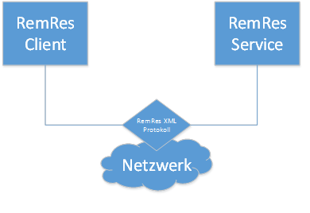
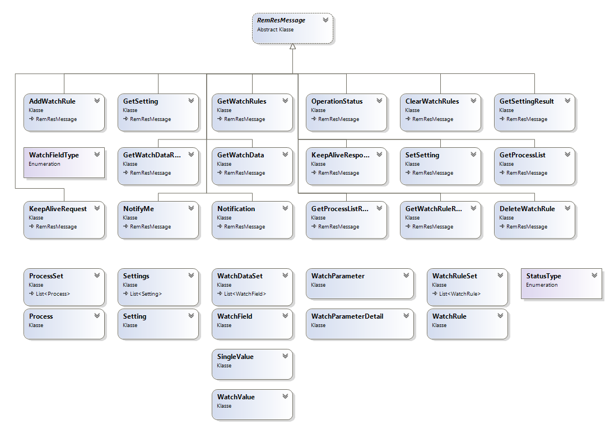
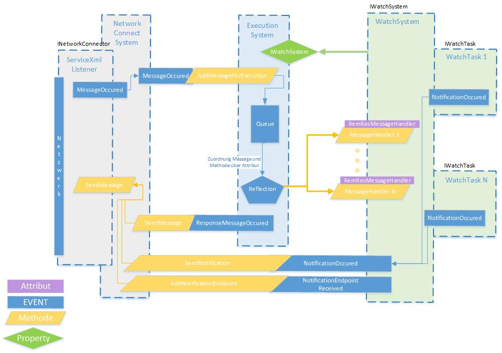
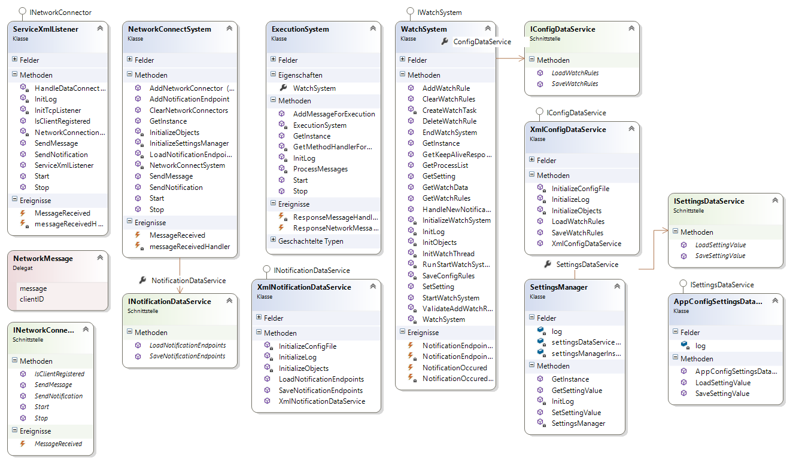
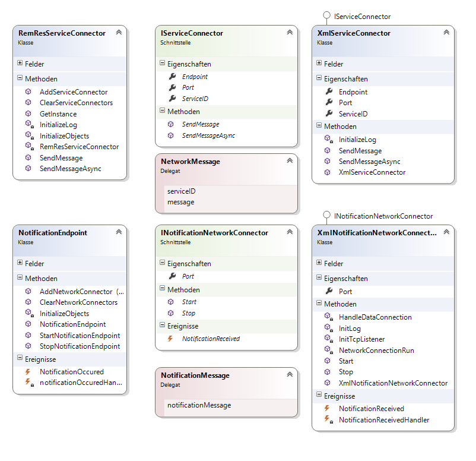
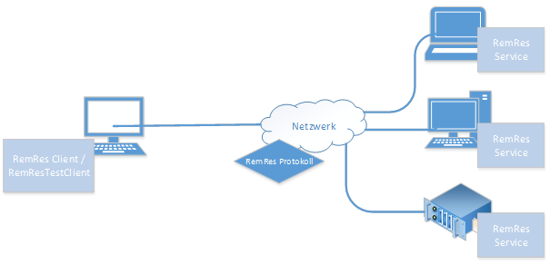

# RemRes
Mittels RemRes soll ein System geschaffen werden um Computereigenschaften remote zu überwachen und diese Überwachung mittels einem Protokoll remote zu parametrisieren.

### Ziele
- Entwurf und Umsetzung eines auf XML basierten Protokolls.
- Entwurf, Entwicklung und Test eines Services der  die Überwachung ausführt und mittels Protokoll gesteuert wird.
- Entwurf und Entwicklung eines Test Clients zur Verwendung des Services.
### Nicht Ziele
- Entwicklung einer  kompletten Inventarisierungssoftware.
- Entwicklung einer mit kompletten funktionsumfang ausgestatteten RemRes Client  Applikation.

## Kernanforderungen
- Mit RemRes muss es möglich sein Eigenschaften eines Computer remote über ein simples aber erweiterbares Protokoll zu überwachen.
- RemRes soll möglichst einfach alle verschiedenste Szenarien angepasst werden.
- Das Protokoll soll von der Implementierung des Services weitestgehend getrennt werden.
- Das Protokoll soll mittels TCP/IP und XML realisiert werden und leicht anpassbar sein.

## Architektur
Das System RemRes wird logisch in zwei Subsysteme untergliedert: RemRes Service und RemRes Client. Diese Subsysteme werden über das RemRes XML Protokoll miteinander verbunden. Dieses Protokoll ist in einer RemRes API in Objekten gekapselt.

## RemRes API / Protokoll
Das RemRes Protokoll wird mittels XML realisiert. Diese XML Nachrichten werden mittels Serialisierung aus .NET Objekten erzeugt und können daher einfach in einer Library bzw. API gekapselt werden.
Dieses API setzt sich aus zwei Teilen zusammen. Zum einen den Messages und zum anderen den Basis Typen. Die Messages oder Nachrichten leiten alle von einer abstrakten Basisklasse RemRes Message ab und sind je nach Aufgabe implementiert. Die Basis Typen werden in allen Nachrichten immer wieder verwendet und sind nicht von RemRes Message abgeleitet. Die Basis Typen können nicht als Message über das Netzwerk verschickt werden.

### Basis Typen

### RemRes Message / Nachrichten

## RemRes Service

Der RemRes Service ist grundlegend in 3 große Teile geteilt die über definierte Schnittstellen miteinander interagieren.
-	Network Connect System
    -	Zugriff auf das Netzwerk.
    -	Behandlung von eingehenden Nachrichten.
    -	Verwaltung der offenen Verbindungen.
    -	Umwandlung von Text (XML) Messages  in Objekte und zur Verfügung Stellung für andere Teilsysteme.
-	Execution System
    -	Finden der Ausführungspläne bzw. Methoden für die jeweilige Nachricht im dafür vorgesehenen System. (Schnittstelle zum WatchSystem)
-	Watch System
    -	Überwachung der Computereigenschaften basierend auf den über das Protokoll mitgeteilten Regeln zur Überwachung. 
    -	Generierung von Notifikation Nachrichten.
    -	Bereitstellung  der Ausführungspläne bzw. Methoden für die jeweiligen Nachrichten.
    
### Dynamisches ausgewertetes Protokoll

Die Protokoll Messages werden beim empfangen im Service durch die im Network System konfigurierte Methode zu Objekten umgewandelt. Diese Nachrichten Objekte werden an das Execution System übergeben. Das Execution System sucht anhand des Types der Message mittels Reflection im Watch System nach einer geeigneten Methode die mittels Attribut „RemResMessageHandler“ auf den Nachrichten Typ gebunden ist.

## Schnittstellen

## RemRes Client
In diesem Dokument wird mittels RemRes Client der RemRes Test Client gleichgesetzt. Der RemRes Test Client bietet im Vergleich zu einem vollständigen Client weniger Funktionen.
Der RemRes TestClient soll die möglichkeit bieten jede Message (bis auf spezielle) an den Service übermitteln zu können und so seine Funktionsfähigkeit zu überprüfen.

## Logical View

### Protokoll
Für eine Detaillierte Erklärung der XML Messages verweise ich hier auf das Dokument RemRes Protokoll.docx. 

### Datenspeicherung
Die Datenspeicherung erfolgt über das ganze Projekt mittels XML Files. Diese Datenzugriffsklassen sind mittels Dependency Injection  implementiert und können dadurch durch beliebige andere Datenspeicherung (auf zum Beispiel eine Datenbank ausgetauscht werden).

### RemRes Service

### RemRes Client (Library)

## Physical View

--- 
FH Wiener Neustadt - Master Studiengang - Student Project
RemRes - Ressourcenüberwachung

Für mehr Informationen siehe **docs** Ordner.
